# 《つくったもの》

## Ero法令検索(2021  <span style="color: red;">New!</span>)

2021年 六本木ヒルズ「東京シティビュー」, Media Ambition Tokyoで展示

政府のウェブサイト「e-Gov法令検索」で公開されている日本の全ての法令の文章のうえに、さまざまな挿絵、色、絵文字が描き足された空間を、足で踏むコントローラーを操作して、漂う体験ができる作品。法律は、ホワイトキューブの空間にぽつんと置かれた展示物のように、無機質で、押し付けるような重苦しさがあるが、そこに絵や色があれば、少しは楽になるんじゃないかと思って制作を始めた。

この作品にはさまざまな「いめーじ」がからみあって、うずまいている。

まず作品の一番最初に示される『道徳経』の文章は、裁判や法律を相対的なものであるとして批判し、人間の恣意的なコントロールを超える絶対的な「天」によって、なんだかんだいって世界がうまく運行しているのだと説いている。人間が積極的に介入しなくても、「天」によって世界はうまいこと調和しているのだ。

それから、作品の中を「歩く」うちに挿入される「絵文字」の数々。これらは数学の記号を用いて構成されている。「絵文字」は活字を組み合わせて感情を表現する。法律と同じく活字は(「標準的な言語」を通して)「標準的な人間」を規定するもので、ひじょうに規範的で重苦しい。その抑圧的な空間から出発して、素材(それぞれの文字)の味を生かしつつ、いろいろなユーモアや感情を表現する。なんとも革命的ではないか。

さらに、展示会場に配置されているステートメントでは、道教的なふわふわと浮遊して飛びまわるイメージと、「憧れる」の語源といわれる「あくがる」という古語、プラトン的な美へと憧れ向かっていく「エロス」のアイデアを融合した文章が展示されている。

体験者の足元には、20年ほど前に発売された「ダンスダンスレボリューション」の家庭用足踏みコントローラーがあって、これを踏んでこの作品を遊ぶ。ちょっとしたノスタルジーてきなものを感じられる。

さまざまな社会の状況を投影した総額600MBを超える壮大な文章群「法令」とこれらの「いめーじ」が絡み合い、融合する！

<div class="split"></div>

  
『Ero法令検索』アプリケーションスクリーンショット

<div class="split"></div>

  
『Ero法令検索』展示風景

<div class="split"></div>

```
政府のウェブサイト「e-Gov法令検索」で公開されている日本の全ての法令の文章のうえに、さまざまな挿絵、色、絵文字が描き足された空間を、足で踏むコントローラーを操作して、漂う体験ができる作品。法律は、ホワイトキューブの空間にぽつんと置かれた展示物のように、無機質で、押し付けるような重苦しさがあるが、そこに絵や色があれば、少しは楽になるんじゃないか。
英語で「法律の」を意味する「リーガル」について考えてみる。漢字「離」の読みは「リ」で、古文では離れることを「がる」と言う。例えば心が体から離れてさまよう意味の古語「あくがる」は、今では「あこがれる」になっている。今いる場所から離れ出ていき、自由に飛び回る、そんなイメージ。
さまざまな色や形を配置していって、美しい風景を作る。そこには美しいものに「あこがれる」気持ち、エロスがある。そういう思いを込めて、「ero法令検索」というタイトルにした。
```  
『Ero法令検索』ステートメント

<div class="split"></div>

## I'm In The Computer Memory(2018)

2018年 国立新美術館, 第21回文化庁メディア芸術祭で展示  
2018年 National Gallery of Indonesia, INSTRUMENTA 2018: SANDBOXで展示  
2018年 大宜味村立旧塩屋小学校, メディア芸術祭やんばる展で展示  
2018年からソースコード・アプリケーションをインターネット公開  
URL: <https://github.com/aidatorajiro/MemgameJS>  
メディア芸術祭アーカイブサイト: <http://archive.j-mediaarts.jp/festival/2018/art/works/21a_Im_In_The_Computer_Memory/>

### 実際に動作している映像

<https://youtu.be/PB19q6_8lCE>

<https://youtu.be/4vvN761sYp4>

2018年の文化庁メディア芸術祭の新人賞を「I'm In The Computer Memory」という作品で受賞した。コンピュータのメモリ空間を白黒のグラデーションに投影した画面の中で、中心に映し出された白い点を自分自身に見立てて探索するというインスタレーション作品。体験者は日常使うコンピュータの中にある小さな宇宙を垣間見ることになる。コンピュータの保存するデータというのは、色々処理されて画面上に例えば書類なんかとして出てきてこそ理解できるけども、その裏側のデータは専門家でもない限り容易に理解できるものではない。しかし、それを例えば白黒のグラデーションを伴った色や形にしてしまうと、船場。廃工場。森林。のように見えるといった「別の意味づけ」が現れてくる。そうすると、機械と人間の分断・機械を知っている人間とそうでない人間の分断が和らぐかもしれない。機械がただ単に機械的に計算をする存在ではなく、すごく人間的な温かみをもった存在として感じとることができるかもしれない。そういったことを狙って作った。この作品は「ゲーム」だと思って作った。というのも、この作品の目的の一つは、自分がコンピュータの世界に入り込んで「観光」したり「冒険」したりするようなことだからだ。ある種、もう一人の自分を思い描くようなことでもある。

何回も試行錯誤したことがある。それはプレイヤー（白い点）が作り出す足跡の軌跡だ。これは位置・速度の変化がatan関数を応用した関数になるように設計して、その上で微妙にパラメータを調整して、一番「心地が良い」動きをするようにした。何が言いたいかというと、この作品は非常に簡素でミニマルなようなものに見えるが、実際は数多の恣意性の上に成り立っているということだ。

さて「裏側」の技術的なことについて言及すると、これはthree.jsというWebGLの描画が行えるJavaScriptライブラリと、JavaScript製のデスクトップアプリを開発することのできるErectronというソフトウェアを使って開発した。実はこのアプリケーション、元々はJavaScriptではなくPythonを使って開発されていて、高校の文化祭に「ゲーム」として出展したのがはじまりである。

<div class="split"></div>

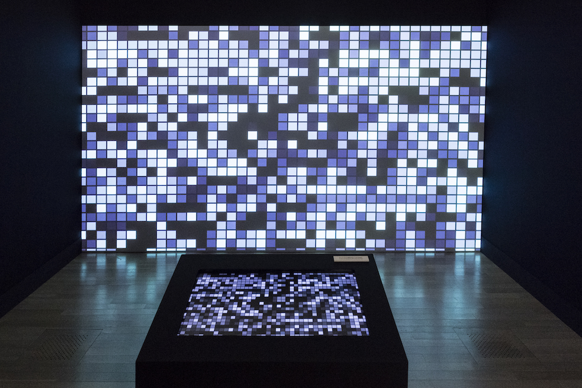  
『I'm In The Computer Memory』文化庁メディア芸術祭での展示風景  
Credit: Japan Media Arts Festival  
<div class="split"></div>  

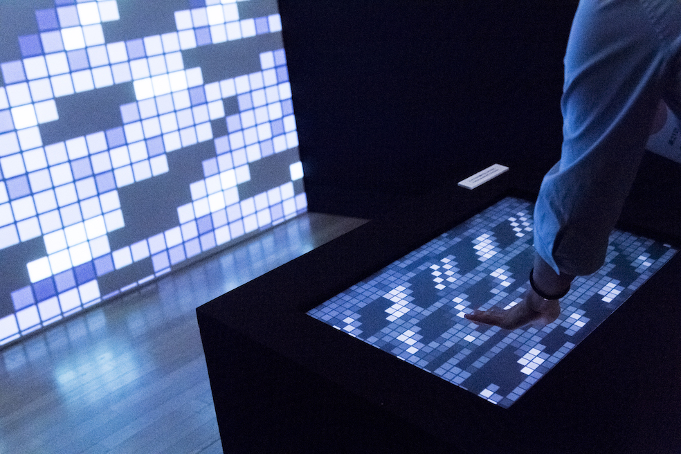  
『I'm In The Computer Memory』文化庁メディア芸術祭での展示風景  
Credit: Japan Media Arts Festival  
<div class="split"></div>

  
『I'm In The Computer Memory』CG展示イメージ  
<div class="split"></div>

  
『I'm In The Computer Memory』CG展示イメージ  
<div class="split"></div>

## 子音ふれんず(2020)
2020年 渋谷キューズ, Media Ambition Tokyoで展示  
2020年からウェブサイトとしてインターネット公開  
URL: <https://aidatorajiro.github.io/sakusaku/sakusaku.html>  
実際に動作している映像: <https://www.youtube.com/watch?v=yD6CshIZKic>  
「I'm In The Computer Memory」の続編のような作品というか、コンセプトの部分でかなり重なる部分がある作品。これは2020年2月-3月にMedia Ambition Tokyoという展覧会で展示された。ひとまず展示の際に用いたキャプションを読もう。

```
コンピュータに文章を入力して、ボタンを押そう。そうすると、単語がたくさん出てくるよ！出てきた単語をマウスを動かして選択していくと、どんどん単語が連なっていくよ。そうしてもう一つの文章が出来上がるわけだけど、この文章は「子音部分が元の文章と同じ」という性質を持つ。元の文章と子音で繋がった、子音ふれんずが見つかる。世の中いろんなことがあるけど、実はそれぞれ何か別のものとウラで繋がっている。普段はそのつながりは隠されているけど、ちょっとしたことで湧き上がってくる。普段は目にすることのできない、もう一つの世界。もう一つの自分。今いる世界だけが世界なんじゃなくて、考え方しだいでどんな風にも変化できちゃう。そんな感じのものを感じとりたいな。…まあ、そういう難しいことを考えなくても、「熱海に行きたい」→「集めない気体」みたいに、自分の思いついたことを書いて、それが変わっていくのを楽しむのもイイよね！
```

このように、一言で言ってしまえば「言葉が子音という繋がりによって多種多様に変化していく様を楽しむ」ゲームであると言える。「I'm In The Computer Memory」はコンピュータがデータを処理する裏側の部分に身を投じて探検するものだった。この作品ではどうだろう。「言葉」というものは、変えようのない現実や「こんなはずじゃなかった」という思いを裏打ちするかのように働く。しかしその作用を逆手にとって、逆に現実を変えることもできるのではないか、そう思ってこの作品を作った。「ありえたかもしれない世界」が垣間見える、そうすれば、今この現実の閉塞感も、少しは和らぐかもしれない。

<div class="split"></div>

  
『子音ふれんず』展示風景  
Credit: Hiroko OKADA  
<div class="split"></div>

## 檄文、TANTATATAN、ドローイング、セカイノカオなど(2015)

2015年 東京都現代美術館 「おとなもこどもも考える ここはだれの場所?」 展に出展

家族で作るアートユニット「会田家」の一員として、2015年東京都現代美術館「おとなもこどもも考える　ここはだれの場所？」展に出展。日本の教育システムの問題を提起する『檄文』(家族全員で制作)、今までに制作してきたドローイング、小学生の頃に監督して作った映像作品『TANTATATAN』、世界中の人々の顔を紹介する『セカイノカオ』(山本光穂、田中秀樹と共に制作)などを展示した。

<div class="split"></div>

  
東京都現代美術館 全体展示空間  
展示風景：「おとなもこどもも考える ここはだれの場所？」東京都現代美術館、2015  
撮影：宮島径  
Courtesy of Mizuma Art Gallery  
<div class="split"></div>

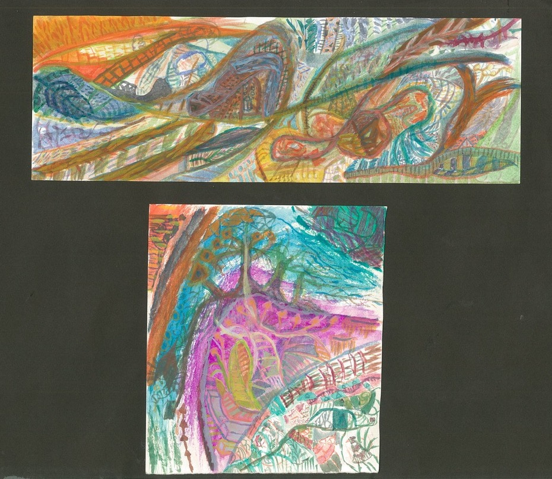  
東京都現代美術館 ドローイング展示  
<div class="split"></div>

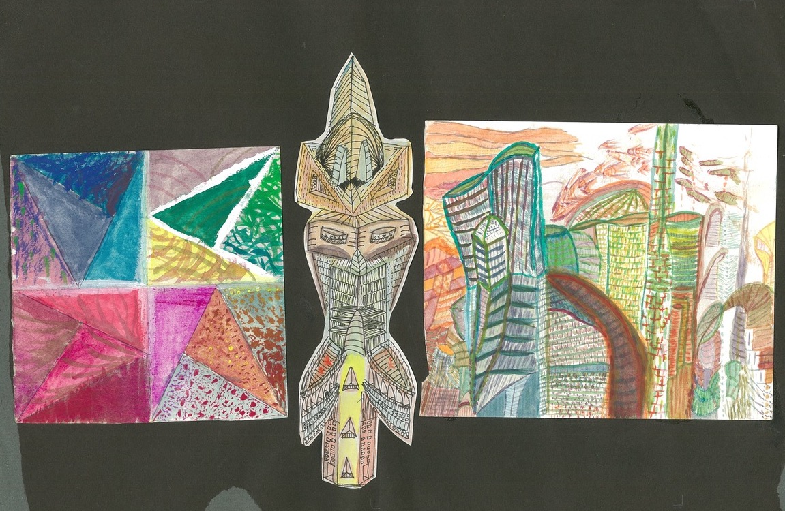  
東京都現代美術館 ドローイング展示  
<div class="split"></div>

  
『TANTATATAN』抜粋  
<div class="split"></div>

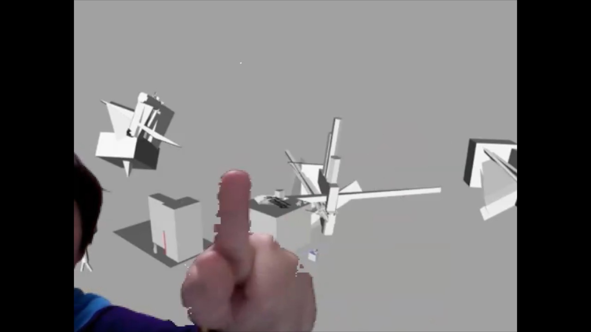  
『TANTATATAN』抜粋  
<div class="split"></div>

## 未踏 ASOBIプロジェクト実績報告書(2018)

2018年制作・未踏事務局に提出

経済産業省の「ソフトウェア開発者育成事業」である「未踏」(2018年度)で、ブラウザ上でブロックチェーンを音や視覚で感じとったり、自分がブロックチェーンのプログラムと同じようにデータを処理する体験をしたりする。ブロックチェーンを構成するプログラムの一部になることで、その構造が理解しやすくなるようなソフトウェアを作った。しかし、あまり、なんというか、理系の研究機関のムードとか、お役所的な空気感とか、そういったものに馴染めなかったので、実際のところはよく覚えていないのだ。特に毎日「日報」とやらを書かなければならないのが、「生産性」とやらをゴリゴリ削り落としていき、まるで先程の『檄文』で指摘していた日本の教育システムの問題のようになっていた。そういったこともあったのだが、最終的に提出する「実績報告書」では、自ら描いたドローイングとともに、芸術とソフトウェア技術を融合する３５ページに渡る長大な論文を書くことに成功した。その一部を紹介する。

<div class="split"></div>

  
未踏 ASOBIプロジェクト実績報告プレゼン  
<div class="split"></div>

  
未踏 ASOBIプロジェクト実績報告書抜粋  
<div class="split"></div>

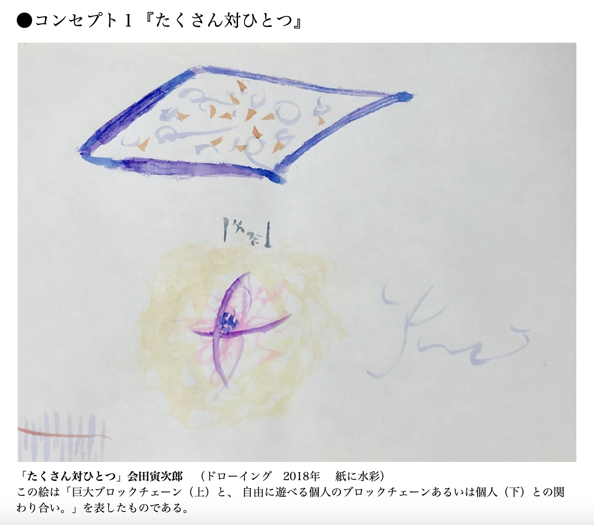  
未踏 ASOBIプロジェクト実績報告書抜粋  
<div class="split"></div>

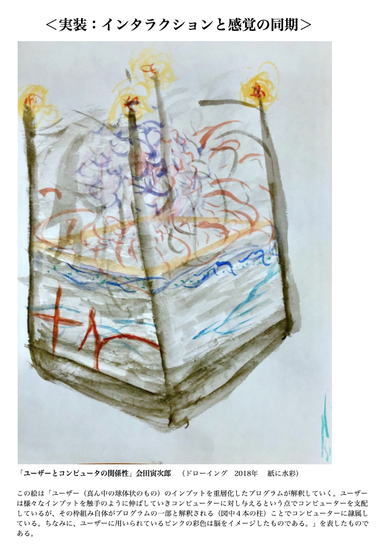  
未踏 ASOBIプロジェクト実績報告書抜粋  
<div class="split"></div>

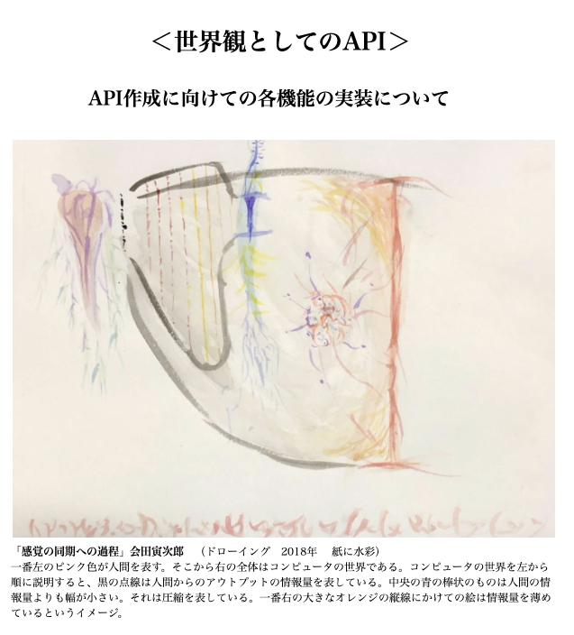  
未踏 ASOBIプロジェクト実績報告書抜粋  
<div class="split"></div>

  
未踏 ASOBIプロジェクト実績報告書抜粋  
<div class="split"></div>

## その他ドローイング

その他、今まで作ってきたドローイングを紹介する。

<div class="split"></div>

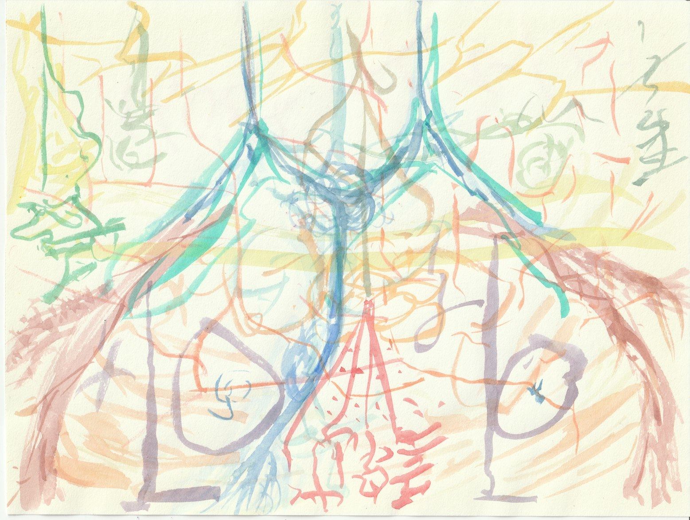  
2020年制作 ドローイング  
<div class="split"></div>

  
2020年制作 ドローイング  
<div class="split"></div>

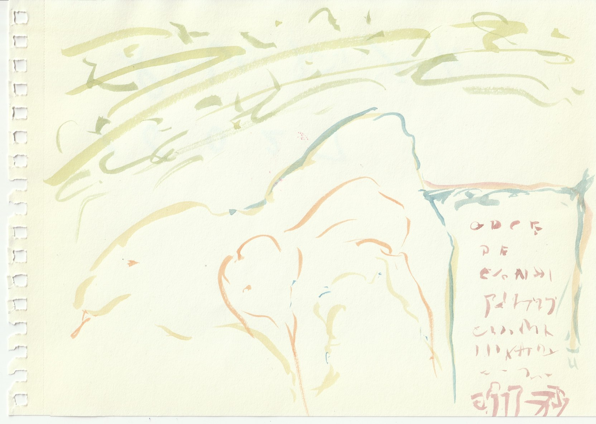  
2020年制作 ドローイング  
<div class="split"></div>

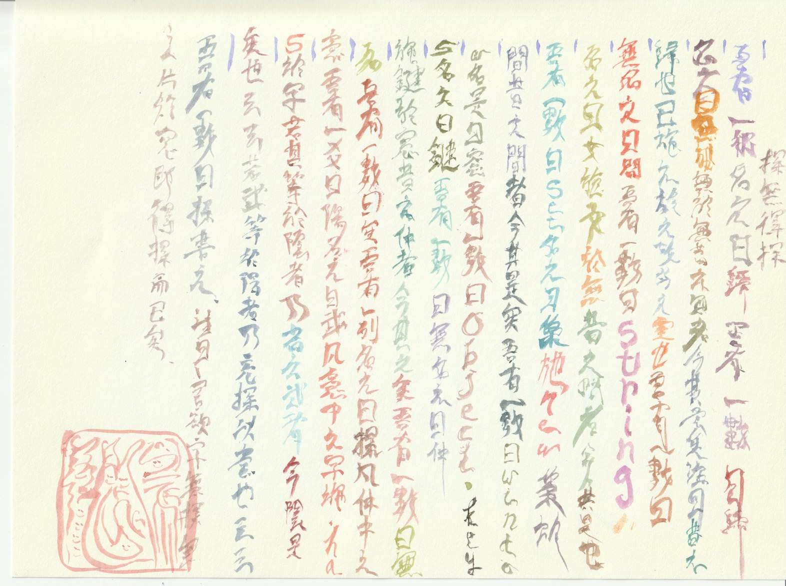  
2020年制作 ドローイング  
<div class="split"></div>

  
2020年制作 ドローイング  
<div class="split"></div>

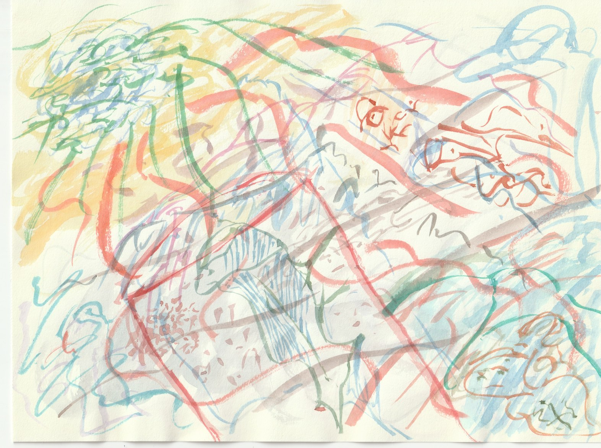  
2020年制作 ドローイング  
<div class="split"></div>

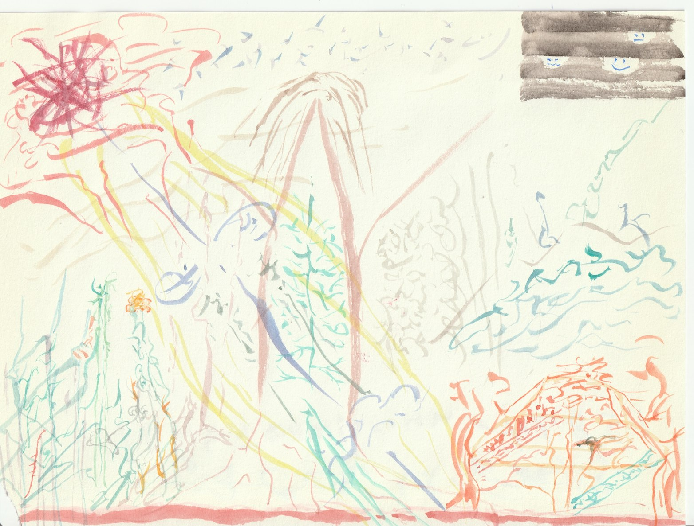  
2020年制作 ドローイング  
<div class="split"></div>

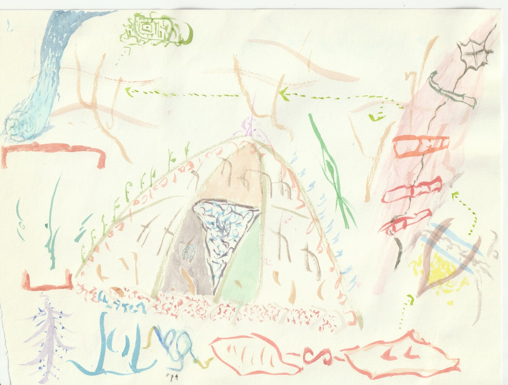  
2020年制作 ドローイング  
<div class="split"></div>

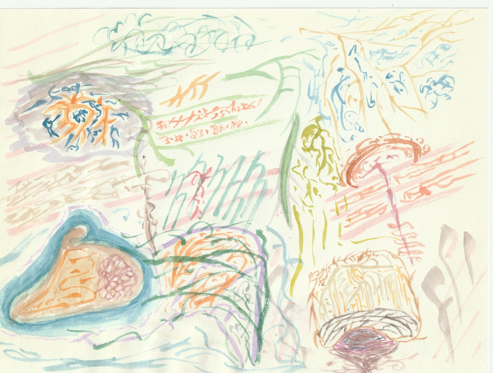  
2020年制作 ドローイング  
<div class="split"></div>

## 月面を歩く / 月面通学路(2020)

2020年 インターネット公開  
プレイ動画: <https://youtu.be/x1tEht5C5ok>  
URL: <https://aidatorajiro.github.io/spec/>

大学入学後、Google Mapを使いながら通学路を色々と考えていたことに着想を得て、月面に道路や建物があることを空想したGoogle Mapのようなものがあれば面白いのではないか、と思い作成したサービス。AIを用いて、月面の写真から「無理やり」路面や建物などのデータを抽出した。「無理やり」あてはめてみること、これも僕が作品を作る上での主要テーマの一つかもしれない。

<div class="split"></div>

  
『月面通学路』ウェブサイトスクリーンショット  
<div class="split"></div>

## RDWP(2017)

2017年から開発しつつインターネット公開中  
URL: <https://rdwp.netlify.app/>

「昔のインターネットにあった、なんの目的で作られたのかよく分からないサイト」であったり、「HTMLとCSSのみで作られた、リンクをクリックしていって世界を探索するゲーム」に似たサイトをHaskellという関数型言語を使って作り出そうとするプロジェクト。後者のサイトの例として、1999年〜2007年まで更新されていた『アドベンチャーゲームオンライン『迷宮』』(<http://hwm7.gyao.ne.jp/ex328/stage/history.html>)がある。関数型言語というのはJavaScript、C、Pythonなどのプログラミング言語と比べ「数学らしい」考え方(例えば、"="の意味が"代入"ではなく"定義"である点など)を持っていて、それが独特の神々しさを放っている。そのような技術に対するロマン主義的（？）な憧憬と、昔の、特に自分が小学生くらいだった時のインターネット文化に対する思いとを重ね合わせた作品と言える。現在も開発中で、ゆっくりじっくり少しずつコンテンツを増やしていっている。

<div class="split"></div>

  
『RDWP』ウェブサイトスクリーンショット  
<div class="split"></div>

  
『RDWP』ウェブサイトスクリーンショット  
<div class="split"></div>

  
『RDWP』ウェブサイトスクリーンショット  
<div class="split"></div>

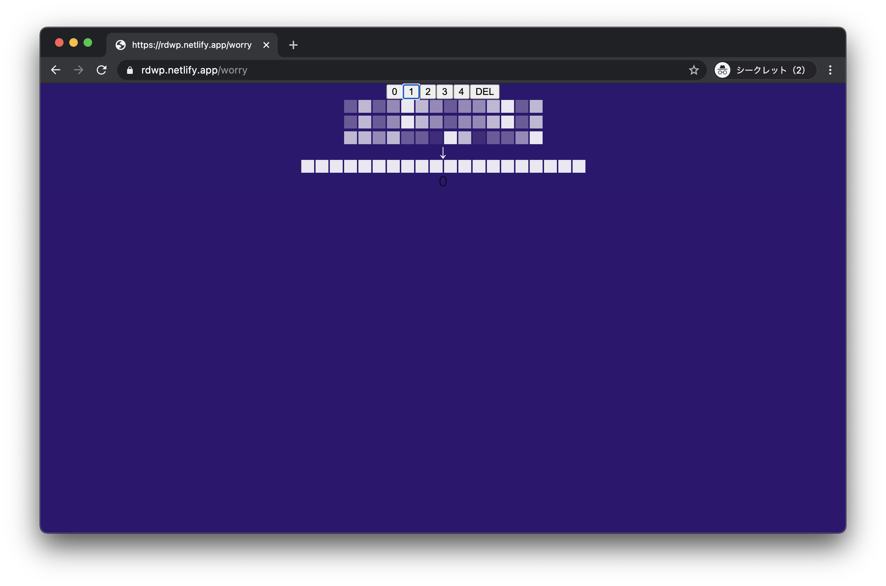  
『RDWP』ウェブサイトスクリーンショット  
<div class="split"></div>

  
『RDWP』ウェブサイトスクリーンショット  
<div class="split"></div>

## ヘブライ仮名(2017)

2017年 インターネット公開  
URL: <https://aidatorajiro.github.io/HeburaiGana/>

『子音ふれんず』の原型となったもう一つの作品。ヘブライ語を一種の「仮名文字」として使って、日本語の文章を書くことのできるシステム。日本語の文章を他の言語を使って暗号のようにして書くことのおもしろさ、そうしてできた暗号文がもしかするとヘブライ語の文として読み解けるかもしれない、誤読の可能性。

<div class="split"></div>

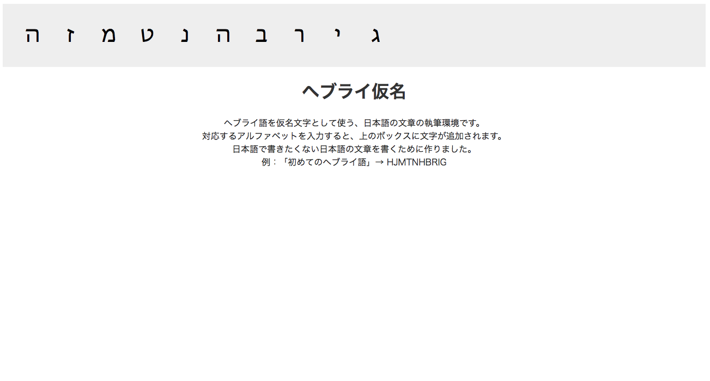  
『ヘブライ仮名』ウェブサイトスクリーンショット  
<div class="split"></div>

## syscall-asobi(2020)

2020年 インターネット公開  
URL: <https://github.com/aidatorajiro/syscall-asobi>

Wineというソフトウェアがある。このソフトウェアはWindowsのアプリをMac OSやLinuxで動かすことができるソフトだが、その動かす方法が少し特殊。OSの重要な機能としてシステムコールというのがあって、システムコールを使うとファイルを読み書きしたり、通信したりといったコンピュータの操作が可能になる。一般的に、システムコールは動的ライブラリというものにまとめられるため、アプリ->動的ライブラリ->システムコール->OSというようにコンピュータの操作が実行される。Wineはこの動的ライブラリを「すげ替える」ことで、擬似的にWindowsアプリが他のOSでも動くようになっている。では、EXEファイル(Windowsアプリ)がシステムコールを直接、動的ライブラリを介さずに呼び起こしたらどうなるのだろうか。EXEファイルでありながら、他のOSを操作してしまうキメラのようなものが出来上がるのではないか。そのようなものをこの実験で合成した。僕の他の作品でも言えるかもしれないが、「いったんある目的のために作られたものが、別の目的に転化する」ということに美学を感じている。そのような美学を体現する作品だ。

<div class="split"></div>

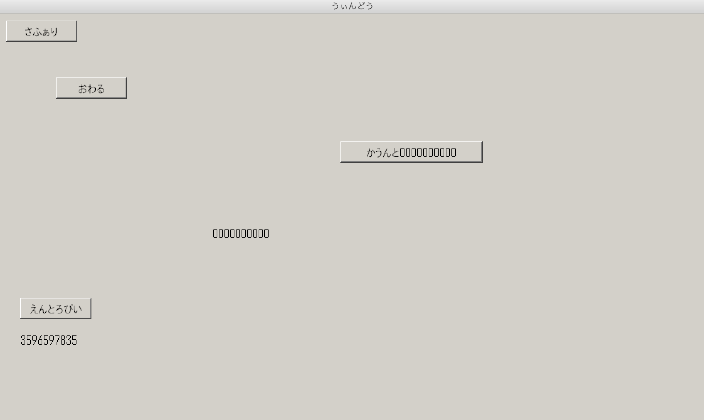  
syscall-asobiスクリーンショット  
説明: 左上の「さふぁり」ボタンを押すと、WindowsアプリでありながらMacOSのSafariを起動できる。また「えんとろぴい」ボタンでMacOS内臓乱数生成機能を使用することができる。  
<div class="split"></div>

## ZineD3(2016)

2016年 インターネット公開

URL: <https://aidatorajiro.github.io/ZineD3/>

魔法陣を自動生成するソフトウェア。

この魔法陣の生成規則というのは、五芒星や六芒星といったものの一般化によってなされていて、数学っぽく言うとn-m芒星のようなものを頑張って定義している。つまり、n角形をベースにして、m個だけ点を飛ばして、線を結んでいって、描画される図形をn-m芒星としている。個人的には7-3芒星(`Z(7, 3)`)が好き。sin cosを感じる。そういえば、僕が作るインターネット上のアバター画像の多くは、このサービスを使って生成した画像をさまざまに加工したものを使っている。

<div class="split"></div>

  
『ZineD3』ウェブサイトスクリーンショット  
<div class="split"></div>

## Tora Blog / ブログサイト

2017年からインターネットで公開・現在も更新中  
URL: <https://torablog.netlify.app/>

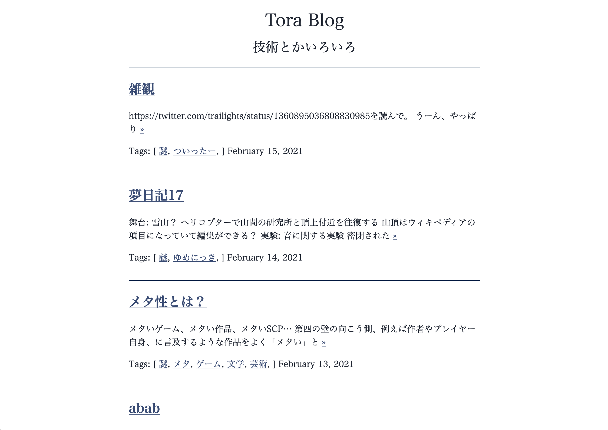

「Tora Blog」という個人的なブログ。書いている内容としては、哲学的な事柄に関する考察や、インターネットや社会の情勢について、自分の見た夢を記録する　夢日記　なるものにはまってゐる。Hugoという静的サイトを自動生成することのできるソフトウェアを使って開発し、静的サイトをホスティングできるNetlifyというサービスを使って公開した。

## Startbahn
Startbahnという、ブロックチェーンによるアート作品の民主化や、作品のインターネットオークションなどを手がけるスタートアップ企業に2018年の2月から2019年の6月まで働いた。まずはブロックチェーンの一つであるEthereumの研究を行った。その後にWebアプリをEthereumやBitcoinと繋げて開発してみる勉強会+ハック大会のようなものをやった。その勉強会で色々なプロジェクトを開発した。

### Itoken market

「Itoken market」は、Ethereum上に実装したトークン売買システムと、そのシステムを動作させるフロントエンドからなるプロジェクトで、AWS上に作成したApacheサーバに、フロントエンドを構築した。ブラウザがアクセスすると、ブラウザ側に元からインストールされているEthereumにアクセスすることのできるソフトウェア(代表的なものにMetamaskがある)を使って、フロントエンドのJavascriptがEthereumネットワークにアクセスを試みる。その後、ユーザの操作に応じて、Ethereumネットワーク上のコードを実行する。・・・う〜ん何いってるかわからないね。とにかく通貨の「価値」が「今どれくらいの通貨が流通しているのか」によって機械的にアルゴリズムによって定まるという仕組みを開発した。

### VTuber戸籍project
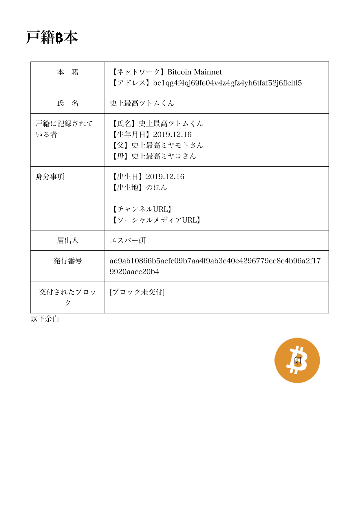

「VTuber戸籍project」は、主にVTuberの人たちが使うことを想定して、ビットコインネットワークを本籍地とする戸籍を作成することのできるサービスである。AWSサーバ内にBitcoin Coreをインストール、Rails+Apacheでクライアントとやり取りして、ユーザの操作に応じてBitcoin CoreのAPIを呼び出し、データを登録する仕組みになっている。まあこれは結構難しい話で、Bitcoinは通貨発行+お金送受信のプラットフォームであつて、単なるデータを保存する場所ではないので、これはBitcoinの正当(正統？)な使い方ではないということが言える。ということでデータ保存のためのさまざまなやり方がイタチごっこ的に規制(ネットワークのアップデートによる制限)されているが、その裏口を見つけるのが楽しかった。

## I'm In The Computer Memory スマートフォン移植版

「I'm In The Computer Memory」をスマートフォンに移植して、iPhoneで動くようにした。これはReactを用いたiOSネイティブのアプリケーション開発ができるフレームワークであるReact Nativeを使って実装した。しかし実のところ、"React"的要素を一切取り入れずにプログラムしたのであった。流行りに乗りつつ、乗らない心。

## 鶴の翼の面積を求めよ.ipynb

2016年 インターネットで公開  
URL: <https://github.com/aidatorajiro/ipynb-docs/blob/master/%E3%81%A4%E3%82%8B%E3%81%AE%E7%BF%BC%E3%81%AE%E9%9D%A2%E7%A9%8D%E3%82%92%E6%B1%82%E3%82%81%E3%82%88/%E9%B6%B4%E3%81%AE%E7%BF%BC%E3%81%AE%E9%9D%A2%E7%A9%8D%E3%82%92%E6%B1%82%E3%82%81%E3%82%88.ipynb>

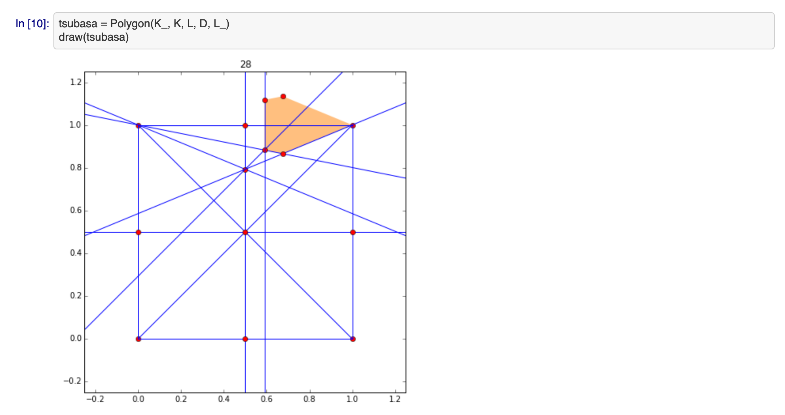

折り紙の折り方の一つ「鶴」における「翼」の部分の面積を「コンピューターを用いて」厳密な数式(単なる数値ではなく、ルートや整数、四則演算を組み合わせた値)で表す。日本古来の文化と、「数式」という西洋の(比較的新しい？)概念との融合。プログラミング、コーディングに当たっては、デフォルトで備わっていた描画機能が十分でなかったため、自作の描画機能を作るはめになったなどの苦労があった。

## Haskell製Bitcoinライブラリ

Bitcoinのトランザクション構造を理解するために作成。

## Rubyのデータシリアライズ方式"Marshal"を解読するプログラム

Rustという今流行りの言語を使って作成。Rubyの内部の仕組みが良く勉強できた気がする。

## Electrumを使ってBitcoin上にデータを書き込むプログラム

<https://github.com/aidatorajiro/elelib>

Bitcoinのクライアントの一つElectrumを使って、任意のデータを書き込めるSegWit スクリプトをBitcoin上で実行できるプログラムを開発。これが先ほど言っていた「VTuber戸籍project」の「裏口」というやつ。SegWitスクリプトの仕様やBitcoinにおける署名の仕様を勉強するのが非常に大変だった。SegWitスクリプトをこのように使っている人はほとんど見かけなかった。優越感。

## MarCoin

<https://github.com/aidatorajiro/MarCoin>

予言入りコイン。ブロックチェーンをアカシックレコードに見立てる。世界の全てはすでに記録されていた！

## Project 3

<https://github.com/aidatorajiro/hakobune/raw/master/MUSIC/2016/Project%203%20%E6%8F%90%E5%87%BA%E7%94%A8/Project%203.mp3>  

<https://github.com/aidatorajiro/sosu>

素数から生成したメロディーを元に音楽を作った。中学生のころ？川崎市の音楽発表会で発表した。素数音符生成プログラムはRubyとHaskellで実装した。

## その他

- 未踏の開発中、オープンソースのパッケージマネージャ「poac」(同じ未踏のプログラムで他の人が開発していたもの)のホームページデザインに少し貢献した。
- 2016年に「Voi Voi Rakkaus」という香港の美容室のサイト製作を請け負った。前のデザイナーが作ったWordPress製のサイトを店舗増設に伴い再デザインし、サイトの別サーバへの移行も行なった。
- Haskell(Reflex)を使った<http://orteil.dashnet.org/nested>に似たWebアプリ。JavascriptよりHaskellの方がプログラムの神聖性が高い！<https://github.com/aidatorajiro/ReflexLab>
- Twitterの「不適切なメディア」の警告を削除してくれるchrome extension。<https://github.com/aidatorajiro/FutekisetuRemoval>
- Excel(Numbers)でのセルオートマトンのアルゴリズム実装 / Haskell(Reflex)を使ったセルオートマトン実装 <https://github.com/aidatorajiro/CellularAutomata>
- 16進数電卓のiphoneアプリ <https://github.com/aidatorajiro/DEntaku>
- 数式から音楽 / 音を生成 <https://github.com/aidatorajiro/ipynb-docs/blob/master/IPYNB-MUSIC/SCIPY_MUSICA.ipynb>
- つるよりももっと複雑な折り方で面積を求める <https://github.com/aidatorajiro/ipynb-docs/blob/master/%E3%83%80%E3%82%A4%E3%83%A4%E3%83%A2%E3%83%B3%E3%83%89/Untitled.ipynb>
- コンピューターを用いて試験問題を作る試み <https://github.com/aidatorajiro/ipynb-docs/tree/master/%E5%95%8F%E9%A1%8C%E3%82%92%E4%BD%9C%E3%82%8D%E3%81%86%EF%BC%81>
- wikiサービス内のデータを電子書籍形式に変換するプログラム または 電子書籍の規格の研究。いくつかのデバイスは規格を無視してepubを読み込む(デバイスごとに独自規格のようになっている)ため 整合性を取るのが大変だった。<https://github.com/aidatorajiro/Wiki2Epub>
- MinecraftのMod / ちょっとだけ危ないブロックを追加するよ <https://github.com/aidatorajiro/MinecraftMod-RealisticScience>


# 《あ》
このサイトは以下のフォントファイルとCSSファイルを使用してます。

- Noto Sans JP (URL: <https://fonts.google.com/specimen/Noto+Sans+JP>)
- normalize.css (URL: <github.com/necolas/normalize.css>)
